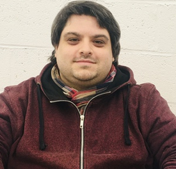

# Loïc Calcagno

*Courage et travail triomphent des difficultés!*

## Moi, en une phrase

On dit de moi que je suis persévérant dans tout ce que j'entreprends. 

|     Questions      |Réponses|
|--------------------|--------|
|Date de naissance?  |  11/01 |
|Genre?              | Homme  |
|Couleur favorite?   | Bleu   |
|Nourriture favorite?| Sushis |
|Ananas sur la pizza?| <ul><li>[x] NON! </li><li>[ ] oui </li></ul>|

## Loisirs 

J'ai différents loisirs :

- Les jeux vidéos bien évidemment 

- La nature 

	- Les balades en forêt 

	- Les randos en montagne

- La natation

- Les films 

	- Jurassic Park

	- Scream 

	- Pirates des Caraïbes 

## Vous pouvez toujours compter sur moi quand... 

vous êtes coincer sur du code, je me ferai toujours une joie de vous aider si je le peux :D 

Et apporter de la bonne humeur à l'équipe bien sûr ;p

## Une histoire drôle

Quand j'étais plus jeune, je suis allé en vacances en France et j'étais sur une plage (à galet (juste du détail)).

Bref! Le temps n'était pas terrible et le petit moi a eu **l'excellente** idée de me rapprocher de la jetée pour observer la mer. 

Arrive ce qu'il devait arriver, une vague arrive et s'écrase sur la jetée... bien évidemment avec moi trempé de la tête au pied! 

### Petit résumé de mon histoire drôle!

Le jour où une vague m'est tombé dessus..

--------------------------------------------------------------------------

<< [PREVIOUS](https://github.com/Yashidao/challenge-markdown) || LOIC CALCAGNO || [NEXT](https://github.com/mara85kh/challenge-markdown) >>